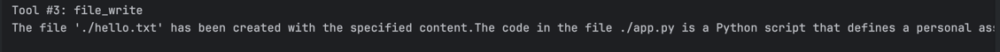

# 🧑‍💻 AI FileOps Agent

An AI-powered personal assistant that can **read, write, and manage local files** using Large Language Models (LLMs) like **Groq Llama‑3.3** and **Gemini 2.5**.  
This project demonstrates how to integrate custom tools with an agent framework to perform local automation tasks through natural language commands.

---

## 🚀 Features
- **File Operations**
  - Read file contents
  - Write new files or overwrite existing ones
  - List directory contents with clear formatting
- **LLM Integration**
  - Configured with Groq’s Llama‑3.3‑70B model
  - Optional Gemini 2.5 Flash model support
- **Agent Capabilities**
  - Summarize file content
  - Execute user instructions in natural language
  - Provide clear explanations of actions taken

---

## 🛠️ Tech Stack
- **Python 3.13+**
- **Strands Agent Framework**
- **Groq API (OpenAI-compatible)**
- **Gemini API (optional)**
- **Custom Tooling** for file operations

---

## Example prompts the app should be able to successfully process

# List directory contents
- List all files in my current directory
response1 = local_agent("Show me the files in the current directory ./ ")

# Read a file
- Read the contents of my `app.py` file and give me a summary
response = local_agent("Read the file ./app.py and explain to me what this code does")

# Create a new file
- Write "Hello, World!" to a new file called `hello.txt` in my current folder
- Read the file `app.py` in my current folder and explain what this code does
response2 = local_agent("Create a file called './hello.txt' with the content 'This is a test file created by my Ollama agent.'")

## Guidance

We will use the [Strands Agents](https://strandsagents.com/latest/) which is an open source SDK that takes a model-driven approach to building and running AI agents in just a few lines of code.

1. Install dependencies (mainly installing strands-agents strands-agents-tools and strands-agents[ollama])

```python
pip install -r requirements.txt
```

2. Run the code to make sure you don't get any errors `python ./app.py`
3. Open `app.py` and read through the code to understand how it works
4. Try each of the response types in `app.py` by commenting/uncommenting  on lines 129-135.

## 🖥️ Example Output

When you run `python app.py`, the agent demonstrates its capabilities:

### 1. Reading a file & providing summary


### 2. Listing directory contents


### 3. Creating a new file



